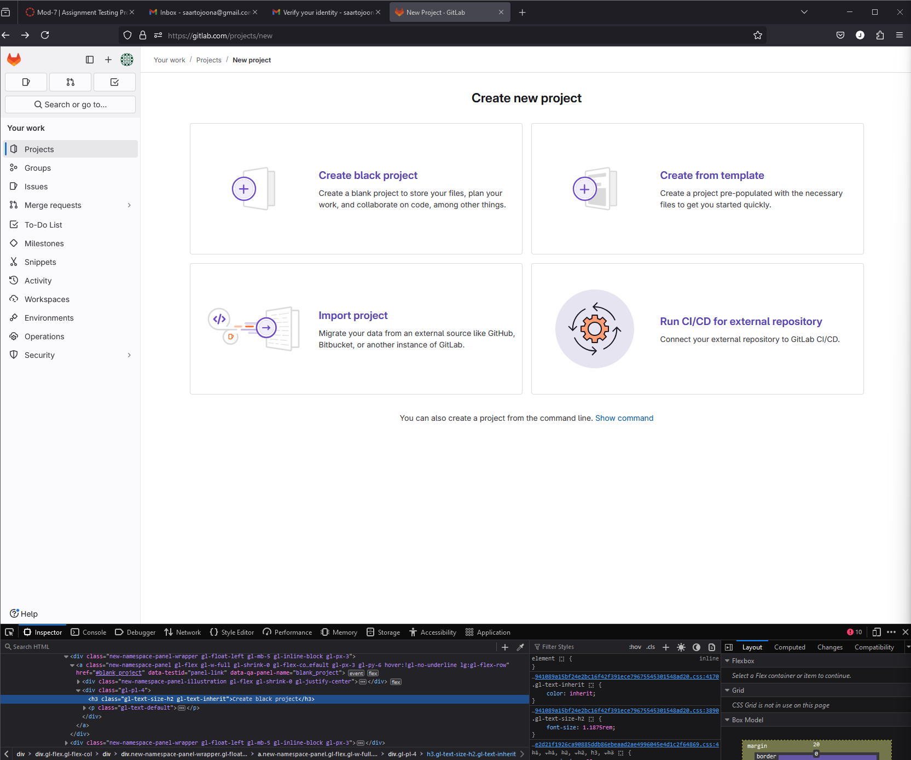

## Summary (Summarize the bug encountered concisely)

Miss typed word "blank" in project creation page.

## Steps to reproduce     

Go to https://gitlab.com/projects/new#blank_project
See the incorrect text "Create a black project" instead of "Create a blank project".

## What is the current bug behavior?

Word "blank" is replaced by "black"
.
## What is the expected correct behavior?

Should contain "blank".
     
## Relevant logs and/or screenshots

    

## Possible fixes

Correcting the typo in the code:

<h3 class="gl-text-size-h2 gl-text-inherit">Create black project</h3>

## Whom do you report/ Assign To/ Tags

qa-tester

## Priority

Minor
